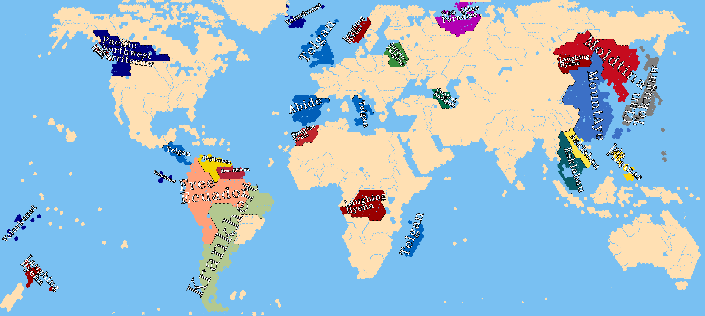

# map-nationstates-philosophers

A world map for the region Philosophers in NationStates

The base map is remixed from [Gedemon/HK-GiantEarthMap](https://github.com/Gedemon/HK-GiantEarthMap).

The lastest version of the map looks like:

To see the zones and borders, click to see the large maps:
- North Hemisphere, old world:
    
- South Hemisphere, old world:
    
- North Hemisphere, new world:
    
- South Hemisphere, new world:
    
